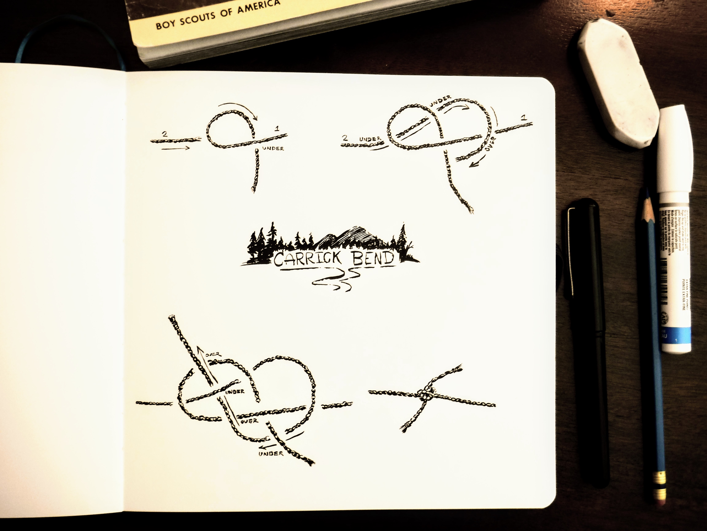
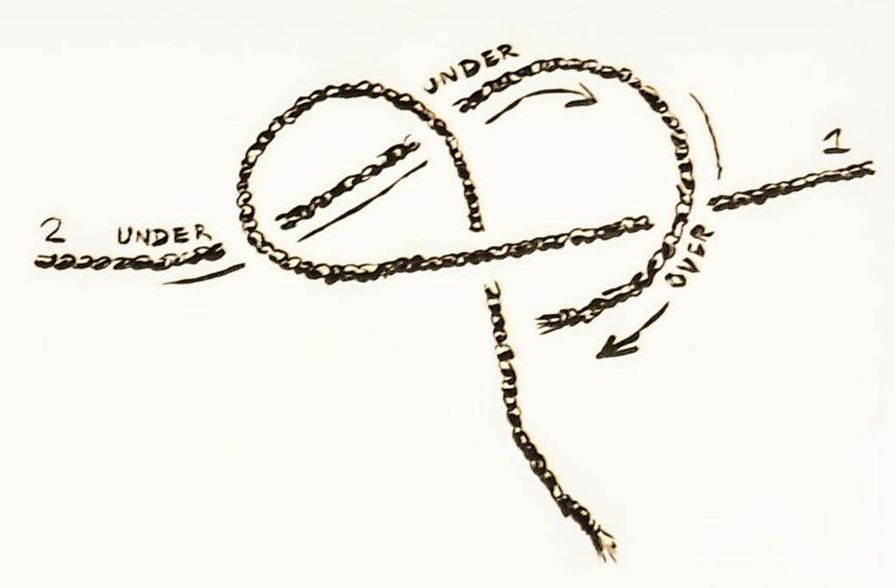

Confession time: I was, and still am, a total knot nerd as a Scout. For some reason, I always loved knowing and tying knots, and pioneering. Even so, the Carrick Bend is a new knot to me. According to some people, it may be stronger than the classic Boy Scout square (or reef) knot. It's a little more involved (to me) to tie than a square knot, but is easier to untie even when very tight.

## Step 1

Start by making a loop _under_ (not over) one end, as shown above with rope 1.

## Step 2

Here's the weird bit: pass the other rope (2) under the middle of the loop in the first rope.  The rest of this knot is a matter of passing this end (rope 2) over, under, over under, but NOT this first step. 

After the two unders beneath the loop, then pass the end of rope 2 _over_ the standing([1](#standing)) bit of rope 1.

## Step 3

This image make look complicated, but essentially we just continued the under, over, under, over pattern with the end of rope 2. First, under the end of rope 1, bended back toward the loop in rope one, and over, under, over. 

It's important to tighten this knot before putting any load on either standing end, to prevent slipping.

## Step 4

As the knot is further tightened, it will [capsize](https://en.wikipedia.org/wiki/Knot#Capsizing), and in the case of this method of the carrick bend, capsizing makes for a stronger knot.

And there you have it. A new joining knot. 

---

  _**Standing** is just a word which refers to the part of the rope that is **not** the end. Sounds obvious, but when tying two pieces of rope together, as we do here, or with any joining knot, the standing part is the bit running off from the knot to the other end of the rope._