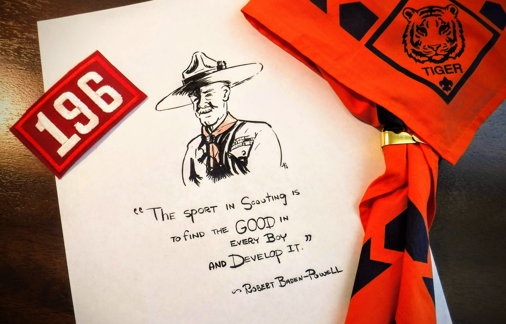

_Baden-Powell carried with him some documents marked "In the event of my death," and among them, an envelop addressed "to the Boy Scouts."_

Dear Scouts,

If you have ever seen the play "Peter Pan," you will remember how the pirate chief was always making his dying speech because he was afraid that possibly when the time came for him to die he might not have time to get it off his chest. It is much the same with me, and so, although I am not at this moment dying, I shall be doing so one of these days and I want to send you a parting word of good-bye.

Remember, it is the last you will ever hear from me, so think it over.

I have had a most happy life and I want each one of you to have as happy a life too.

I believe that God put us in this jolly world to be happy and enjoy life. Happiness doesn't come from being rich, nor merely from being successful in your career, nor by self-indulgence. One step towards happiness is to make yourself healthy and strong while you are a boy, so that you can be useful and so can enjoy life when you are a man.

Nature study will show you how full of beautiful and wonderful things God has made the world for you to enjoy. Be contented with what you have got and make the best of it. Look on the bright side of things instead of the gloomy one.

But the real way to get happiness is by giving out happiness to other people. Try and leave this world a little better than you found it, and when your turn comes to die you can die happy in feeling that at any rate you have not wasted your time but have done your best.

"Be Prepared" in this way, to live happy and to die happy - stick to your Scout promise always - even after you have ceased to be a boy - and God help you to do it.

Your friend,

_Baden-Powell of Gilwell_

ht: [Source](https://en.wikisource.org/wiki/Last_message_to_scouts)